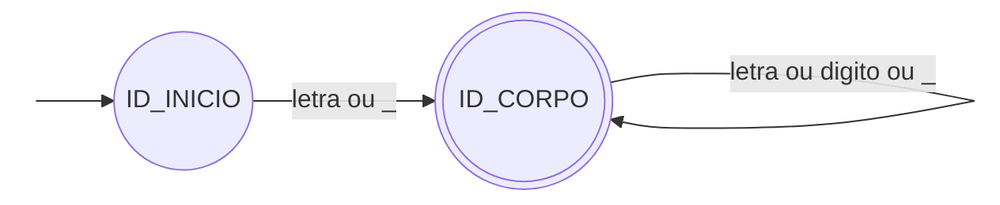
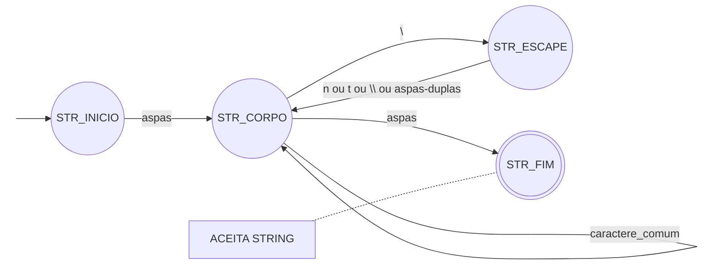
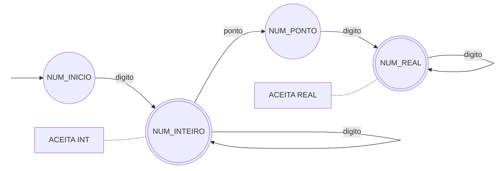
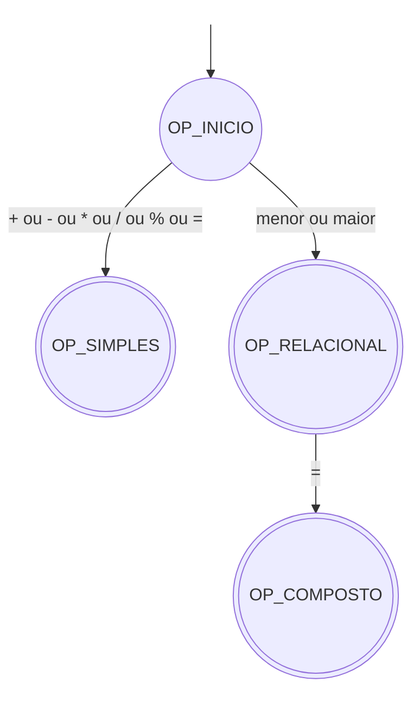
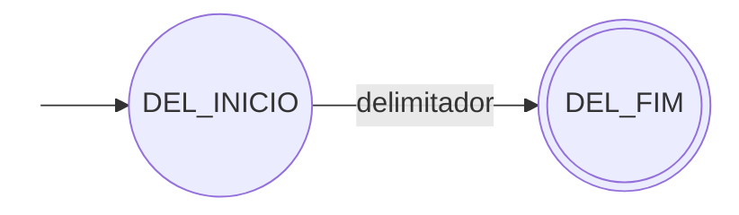
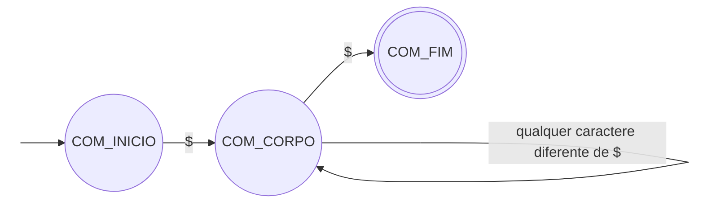

# Autômatos Finitos Determinísticos
## 1. Caracteres válidos
```
letra   = [A-Za-z]
dígito  = [0-9]
```
## 2. Identificadores e palavras reservadas

```
identificador = (letra | "_") (letra | dígito | "_")*
```



## 3. Strings

```
string          = aspas (caractere_comum | barra escape)* aspas
aspas           = "
barra           = \
caractere_comum = qualquer caractere exceto aspas, barra e quebra de linha
escape          = um dos caracteres: "  \  n  t
```

Nessa notação, `escape` é o caractere lido depois da barra. As sequências completas permitidas são `\"`, `\\`, `\n` e `\t`.



## 4. Literais numéricos

```
inteiro = dígito+
real    = dígito+ "." dígito+
```



Depois do primeiro dígito, já existe um inteiro válido. A leitura permanece em `NUM_INTEIRO` enquanto houver dígitos; se aparecer `.`, passa para `NUM_PONTO`.

Esse estado não aceita. Falta pelo menos um dígito para completar a parte decimal e chegar a `NUM_REAL`.


## 5. Operadores

Os operadores simbólicos são `+`, `-`, `*`, `/`, `%`, `=`, `<`, `>`, `<=` e `>=`. Todos geram o tipo `OPERATOR`; o lexema identifica qual foi lido.




No desenho, `menor` representa `<` e `maior` representa `>`.

Os operadores de um caractere chegam a `OP_SIMPLES`. Para `<` e `>`, existe uma leitura adicional: se o próximo caractere for `=`, ele é consumido e o autômato chega a `OP_COMPOSTO`. Caso contrário, o scanner emite o operador já reconhecido, sem consumir o próximo caractere.

Essa é a regra de **maximal munch** para os operadores: `<=` é um token só. O mesmo vale para `>=`.

Não há `==` nem `!=`. O texto `==` produz dois tokens `=`, enquanto `!` gera erro léxico. A igualdade é escrita com `equal`; para desigualdade, usa-se `not (a equal b)`.

## 6. Delimitadores

```
delimitador = "(" | ")" | "{" | "}" | "," | ";"
```



Cada delimitador ocupa um caractere e gera `DELIMITER`. Não há forma composta.

| Símbolo | Uso |
|---|---|
| `;` | termina todo comando |
| `,` | separa parâmetros e argumentos |
| `( )` | parâmetros, chamadas e expressões |
| `{ }` | blocos |

## 7. Comentários e espaços em branco

Comentários começam e terminam com `$`. Entre esses marcadores, qualquer caractere é permitido, inclusive quebra de linha.




